---
categories:
- Perspectives
date: 2026-07-27 19:40:00+00:00
feature: feature.jpg
heroStyle: big
summary: Toda grande transformação tecnológica enfrenta resistência moralizante antes
  de se consolidar como o novo cânone. Um ensaio sobre gatekeeping, linguagem de domínio
  e intenção humana.
tags:
  - ai
  - art
title: "IA Generativa e Arte: É Realmente Apenas Slop?"
slug: "genai-and-art-is-it-really-just-slop"
aliases:
  - "/pt-br/posts/20260727-genai-and-art-is-it-really-just-slop/"
description: "Um ensaio sobre a arte gerada por IA: é realmente apenas slop? Uma análise sobre gatekeeping, paralelos históricos, linguagem de domínio e intenção."
proficiencyLevel: "Beginner"
---

"Slop" é o insulto definitivo deste ciclo tecnológico. É uma palavra útil: traduz com precisão o cansaço de abrir uma timeline infestada de conteúdo preguiçoso, gerado por quem digita três palavras numa caixa de prompt e publica o resultado sem qualquer critério ou revisão. Mas será justo usar esse termo para desqualificar de antemão toda uma nova categoria de expressão artística?

## Um esclarecimento inicial: este ensaio não é sobre treinamento de IA

Antes de avançarmos, vamos tirar o elefante da sala: não pretendo discutir dados de treinamento, *web scraping* ou legislação de direitos autorais aqui. Não sou qualificada para opinar sobre esses temas e não tenho a pretensão de tentar.

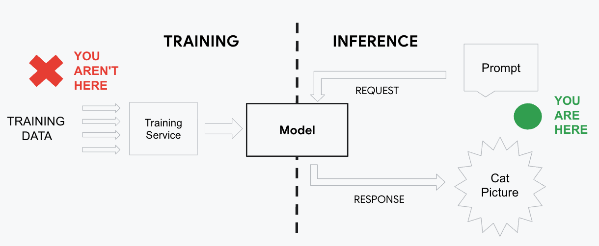

Por outro lado, sou pragmática. Esses modelos existem e vieram para ficar. As pessoas vão usá-los, quer queiramos ou não. Por isso, deixo essa discussão para quem é da área e prefiro focar no que está ao nosso alcance: a inferência — ou seja, o processo de criar arte por meio de *prompting*.

## A natureza cíclica da tecnologia e da arte

Você já reparou que, ao estudarmos a História da humanidade, quase sempre estudamos a História da Arte em paralelo? Toda grande revolução tecnológica inaugura uma nova forma de produzir arte. Vimos esse ciclo acontecer com a prensa móvel, com a fotografia e com os computadores, para citar apenas alguns marcos. Não por acaso, cada uma dessas novas linguagens foi duramente criticada pela "velha guarda" de sua época.

Na Holanda do século XVII, os realistas holandeses pintavam o cotidiano: comerciantes, tavernas barulhentas e a intimidade de cozinhas simples. Os pintores clássicos rotulavam essas obras de vulgares, comerciais e preguiçosas. Durante a Revolução Industrial, os neoclássicos zombavam do lirismo dramático do Romantismo, tratando-o como "delírio febril". No entanto, ambos os movimentos conquistaram os museus e se transformaram no cânone tradicional que as gerações seguintes precisaram desafiar.

A hostilidade em torno da arte gerada por IA repete exatamente essa mesma fórmula. O que testemunhamos hoje é o choque inevitável entre um novo meio expressivo e noções consagradas de manufatura e técnica.

## Slop para alguns, arte para outros

Nunca precisamos de IA para criar conteúdo descartável. Muito antes dos modelos de texto para imagem, a sociedade já debatia onde termina a arte e onde começa o ruído sem valor. A pergunta fundamental sempre foi: onde traçamos essa fronteira?

Vamos comparar algumas obras emblemáticas e seus paralelos contemporâneos.

### Retrato clássico vs. arte pop de consumo em massa

| *Mona Lisa* (Leonardo da Vinci) | *Mona Cat* (Romero Britto) |
| :---: | :---: |
| 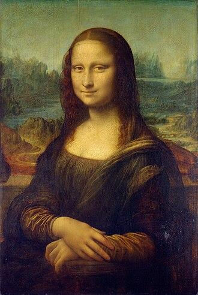 | 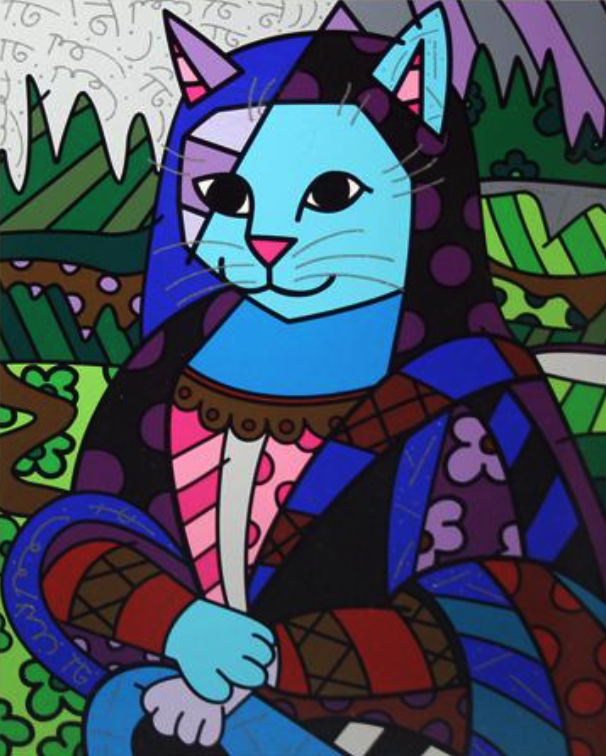 |

A *Mona Lisa* de Da Vinci é universalmente aclamada como obra-prima da alta cultura. Mas e a *Mona Cat* de Romero Britto? Críticos frequentemente desqualificam a produção de Britto como produto comercial de baixa densidade (*slop*), apontando sua reprodutibilidade industrial e caráter derivativo. Na sua avaliação, essa crítica é justa ou se resume a uma questão de gosto pessoal? Não existe resposta definitiva: cada obra desperta reações distintas em públicos distintos.

### Intenção vs. execução

| *Ecce Homo* (Elías García Martínez) | *Ecce Homo "Restaurado"* (Cecilia Giménez) |
| :---: | :---: |
| 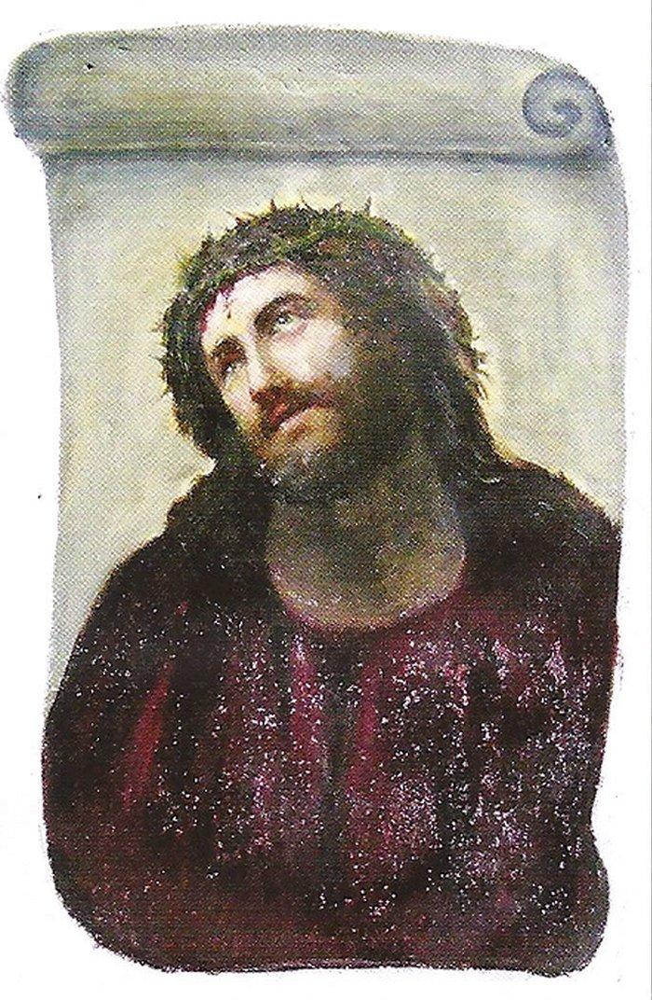 | 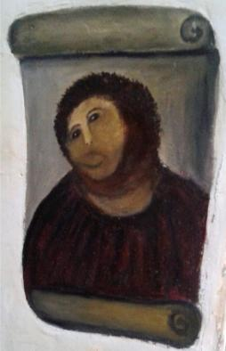 |

O que a maioria julgaria como uma tentativa desastrosa de restauração de um afresco desgastado acabou se transformando em uma dádiva para o vilarejo de Borja, na Espanha. Graças à internet, o interesse pelo [Ecce Homo](https://pt.wikipedia.org/wiki/Ecce_Homo_de_Borja) (pintado por Elías García Martínez por volta de 1930) explodiu, transformando o local em ponto turístico internacional e ícone da cultura pop. Este é um caso em que a técnica da artista-restauradora amadora Cecilia Giménez não alcançou sua intenção inicial, mas o próprio ato e seu resultado ganharam status de arte involuntária.

| *Girl with Balloon* (Banksy) | *Love is in the Bin* (Banksy) |
| :---: | :---: |
| 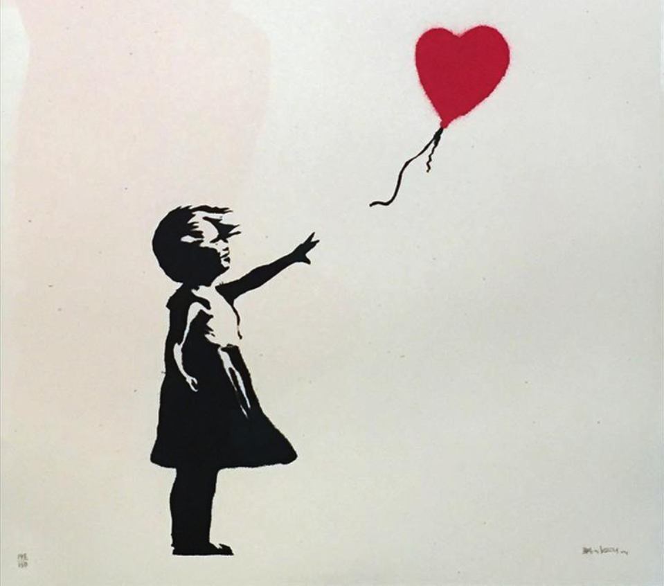 | 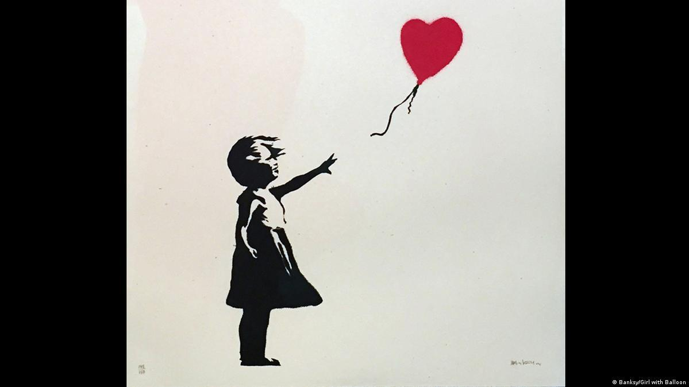 |

Outro caso célebre em que intenção e execução divergiram — criando uma nova obra no processo — é *Love is in the Bin*, de Banksy. O mecanismo oculto na moldura, projetado para destruir a tela caso fosse a leilão, travou na metade da trituração, deixando *Girl with Balloon* parcialmente intacta. A experiência coletiva de assistir a uma obra que acabara de ser leiloada por mais de um milhão de libras ser picotada ao vivo tornou-se, por si só, uma performance artística arrebatadora. Em seu leilão seguinte, o quadro retalhado foi vendido por mais de 18 milhões de libras!

### Banana de galeria vs. kiwi esquecido

| *Comedian* (Maurizio Cattelan) | *Forgotten Kiwi* (Daniela Petruzalek) |
| :---: | :---: |
| 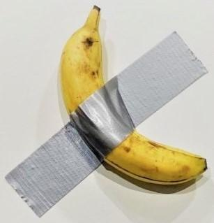 | 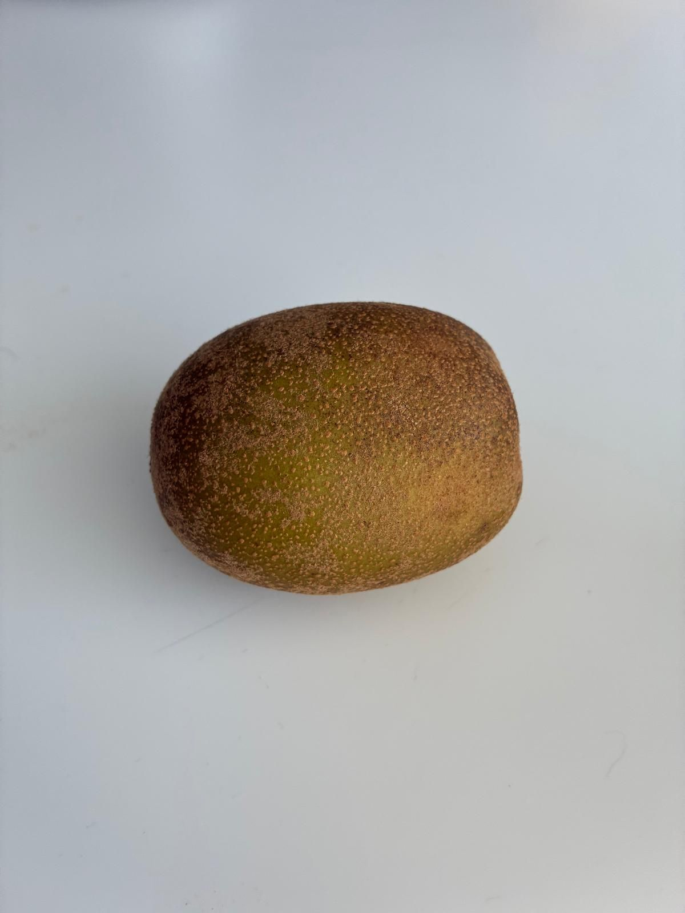 |

Talvez este seja o exemplo definitivo de arte de baixo esforço manual do nosso tempo, mas que ainda assim alcançou US$ 120.000 em um leilão de prestígio: Maurizio Cattelan fixou uma banana na parede da galeria com fita adesiva. E o comprador? Comeu a fruta. Tudo indicaria se tratar apenas de uma banana superfaturada, não fossem o contexto institucional e o título provocativo: *Comedian*. Parte do público enxerga a obra como piada vazia (*slop*); outros a interpretam como uma crítica contundente ao mercado de arte e à mercantilização da cultura.

Por que o *Comedian* é consagrado como arte, enquanto este kiwi esquecido no fundo da minha geladeira não seria? (Fique tranquila: assim como o colecionador de Cattelan, eu comi o kiwi logo após tirar a foto.) O fato é que a arte nunca foi definida unicamente pelo esforço físico empregado ou pela tangibilidade do objeto: ela reside no contexto, na intenção e na reação provocada no público.

Sem nenhuma ironia: agora que meu *Kiwi Esquecido* apareceu em palestras e nas páginas deste blog, talvez ele tenha, de fato, se tornado arte.

## Não devemos fazer *gatekeeping* na arte

Sempre que surge uma nova mídia, os guardiões de plantão (*gatekeepers*) tentam ditar o que pode ou não ser chamado de "arte de verdade". Quase sempre, condicionam suas definições ao suor físico, à destreza manual ou ao domínio de instrumentos tradicionais.

Quando a fotografia surgiu no século XIX, pintores acadêmicos a rejeitaram sumariamente. Argumentavam que pressionar um disparador era um ato mecânico demais para expressar sensibilidade artística, por prescindir do domínio do pincel. Foram necessárias décadas para que a fotografia conquistasse seu merecido reconhecimento.

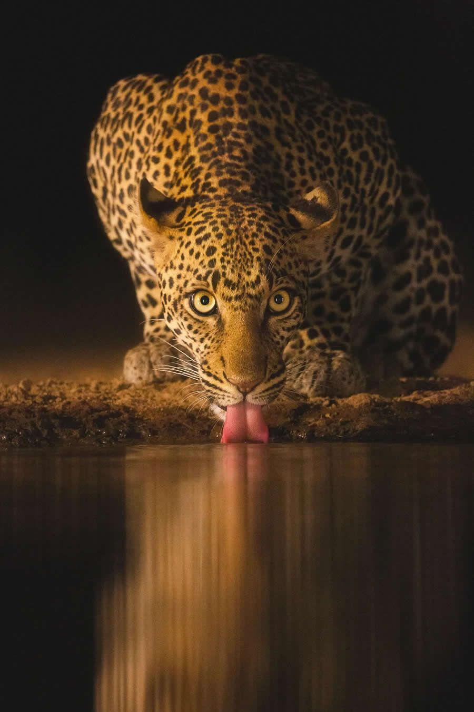

Apertar um botão leva uma fração de segundo. Mas registrar uma imagem como *Eyes of the Night*, de Jade Gosrani, exige semanas de rastreamento na selva, domínio absoluto da luz e paciência inabalável. O valor artístico reside na visão, no planejamento e na intenção autoral, não no clique mecânico do disparador.

Em diversas outras manifestações culturais, já separamos com naturalidade a visão criativa da execução técnica:

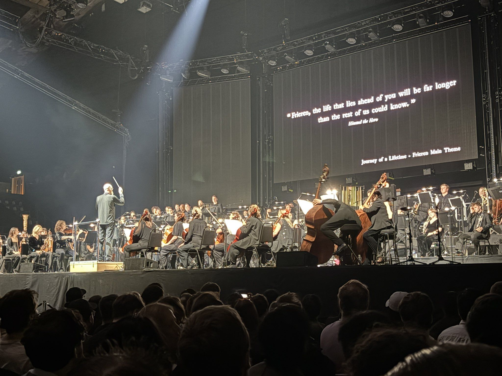

Na música, creditamos a trilha sonora de *Frieren* ao compositor Evan Call. Em uma apresentação ao vivo, Call não executa todos os instrumentos no palco: dezenas de músicos tocam sob a batuta de um regente, enquanto o compositor fornece a visão estrutural, a harmonia e a partitura.

| *Akira* (Katsuhiro Otomo, 1988) | *Titanic* (James Cameron, 1997) |
| :---: | :---: |
| 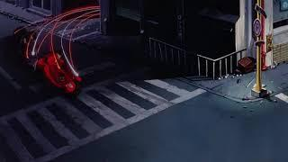 | 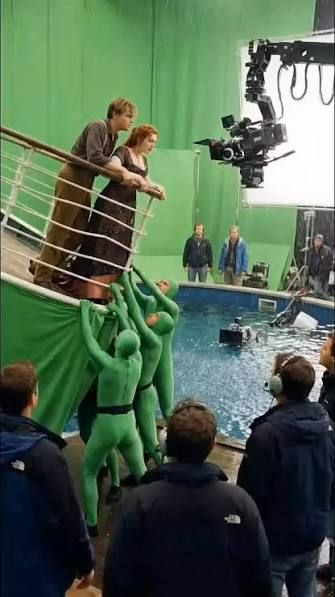 |

No cinema, a animação *Akira*, de Katsuhiro Otomo, conta com mais de 160.000 fotogramas desenhados à mão. Obviamente, Otomo não desenhou cada quadro individualmente: um estúdio inteiro materializou sua concepção visual. Em *Titanic*, de James Cameron, centenas de especialistas ergueram maquetes e computaram efeitos visuais, mas o crédito autoral permanece com o diretor que esculpiu a narrativa cinematográfica.

A Wikipédia sintetiza a complexidade do tema com uma [definição ampla de arte](https://pt.wikipedia.org/wiki/Arte):

> *"A arte é uma atividade humana ligada a manifestações de ordem estética, feita por artistas a partir de percepções, emoções e ideias, com o objetivo de estimular esses sentimentos no espectador."*

Curiosamente, o parágrafo subsequente reconhece a ausência de unanimidade:

> *"Não existe uma definição única ou universalmente aceita do que constitui a arte, e sua interpretação variou bastante ao longo da história e entre diferentes culturas."*

Se nem os compêndios enciclopédicos conseguem aprisionar a arte em uma definição rígida, qualquer tentativa de *gatekeeping* está fadada ao fracasso. O talento não se limita ao trabalho braçal: ele se projeta na direção criativa.

## Uma definição pragmática de *slop*

A meu ver, o *slop* nasce quando há ausência de visão, empenho ou intenção genuína. É o equivalente ao *fast food* na produção de conteúdo. Para quem gosta de pensar matematicamente, costumo dizer que **o slop é inversamente proporcional à inspiração**:


\[
 \text{SLOP} \propto \frac{1}{\text{INSPIRAÇÃO}}
\]

Inspirar-se significa resgatar uma ideia mental e lapidá-la até que converse com a experiência alheia. Se você não aporta nenhuma inspiração à ferramenta, o resultado inevitável será *slop*, por mais refinado que seja o modelo utilizado.

Compare um prompt genérico de duas palavras como `anime girl` com a descrição a seguir, que mobiliza o vocabulário técnico da ilustração para dar vida a uma estética precisa:

```text
Character: teenage girl with pink hair, shoulder length, wavy. 
Blue eyes, gentle smile. School uniform, white blouse, tartan skirt.

Scenario: classroom, back seat, close to the window.

Action: girl is sitting at her desk, book open in front of her, but 
she is looking at the window, holding her chin with her left hand, 
melancholic look, pensive.

Style: anime, watercolor, 90's, pastel tones, shoujo

Environment: midday light, natural light from the window, artificial 
light from the ceiling

Camera: low angle, profile picture three-quarter view
```

E o resultado gerado:

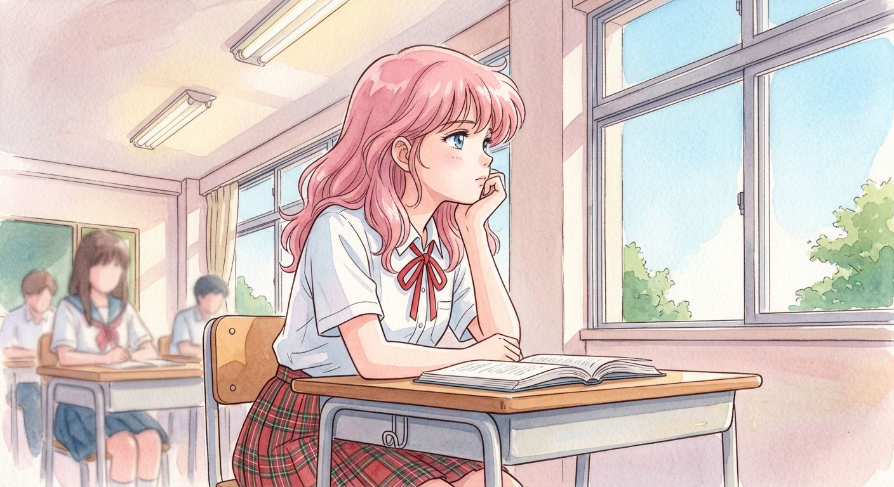

O segundo prompt demonstra domínio sobre estilos pictóricos, enquadramento cinematográfico, iluminação e composição de cena. O resultado visual sofrerá pequenas variações a cada execução, mas a atmosfera, o clima emocional e a estética geral se mantêm coesos graças à clareza das diretrizes criativas.

Para direcionar um modelo com maestria — seja para gerar ilustrações ou produzir código —, é indispensável dominar a **linguagem de domínio** da sua mídia. Para imagens cinematográficas, você precisa conhecer angulações e esquemas de iluminação (*low angle*, *three-quarter view*, *rim light*). Para ilustrações, precisa conhecer movimentos artísticos e técnicas visuais (*90s shoujo*, *watercolor*).


Um prompt estruturado (como o modelo proposto por [@kantakanta1233](https://x.com/kantakanta1233)) cobre dez pilares fundamentais: estilo, tema, características, vestuário, pose, composição, cenário, iluminação, acabamento e parâmetros negativos. Construir uma especificação desse porte é um exercício legítimo de direção criativa — e, mesmo após a formulação do prompt, sucedem-se testes e ajustes finos até a consolidação da peça final. Tudo isso integra o fazer criativo.

## Ter um bom prompt não basta: ele precisa ser fruto da sua autoria

Essa questão surgiu durante uma das minhas palestras no GDG Community Summit e considerei essencial registrá-la aqui. Imagine que alguém dedique tempo e sensibilidade refinando o prompt perfeito, até que outra pessoa simplesmente copie esse texto e o execute sem qualquer esforço autoral. Isso constitui arte?

Nesse cenário específico, o ato em nada difere de falsificar uma pintura ou copiar e colar trechos de código do Stack Overflow. Quem apenas se apropria do prompt alheio atua como um mero replicador (*copycat*). Rastrear a procedência original de criações visuais na internet é um desafio complexo, mas reputação, integridade e consistência continuarão sendo os pilares que diferenciam a expressão genuína da cópia preguiçosa.

## O paralelo com a engenharia de software

Caso ainda não tenha percebido, todas as reflexões tecidas aqui sobre arte se aplicam integralmente à engenharia de software. Embora boa parte da nossa comunidade já tenha incorporado o desenvolvimento assistido por IA, muitos ainda desdenham da prática, rotulando-a como o *slop* do "vibe coding". Existe um receio palpável de que essas ferramentas desvalorizem a carreira de programação.

Para mim, o impacto da IA tem sido diametralmente oposto. Além de automatizar tarefas burocráticas (espero nunca mais precisar escrever manualmente um CRUD genérico!), ela me capacita a realizar projetos que eu jamais conseguiria tirar do papel sozinha.

Toda a razão que me motivou a ingressar na área de exatas foi o sonho juvenil de criar videogames — um plano que acabou não se concretizando profissionalmente na época (sem nenhum arrependimento, diga-se de passagem). Hoje, com o suporte das IAs generativas, a barreira de entrada diminuiu tanto que posso me divertir construindo jogos autorais mesmo com tempo e recursos restritos. Não sei compor arranjos orquestrais sozinha, mas com o apoio do Gemini e do Lyria 3 consigo guiar a inteligência artificial para materializar minha trilha sonora. Não disponho de horas para desenhar pixel por pixel de cada sprite, mas com o Nano Banana produzo os assets necessários e coloco um protótipo jogável de pé em questão de horas, não de meses.

A essência da engenharia nunca residiu na digitação mecânica de código em um editor, da mesma forma que a arte nunca se resumiu ao ato de empunhar um pincel. À medida que as ferramentas generativas absorvem as tarefas operacionais — renderizar texturas ou gerar código boilerplate em Go —, nosso papel sobe na pirâmide de valor: arquitetura, estratégia, domínio do problema e intenção de entrega.

O alarme atual não decreta a morte da criatividade humana; reflete apenas a fase de transição de um ciclo histórico já percorrido com a imprensa, a fotografia e os primeiros compiladores. O ímpeto inicial de rejeição tenta resguardar métodos familiares. Com o passar do tempo, as resistências cedem, as novas ferramentas são naturalizadas e o meio se renova. O que os céticos hoje descartam como "slop" se consolidará como o padrão produtivo de amanhã — até se tornar a tradição que os próximos criadores buscarão reinventar.

E você, o que pensa a respeito? Enxerga a arte generativa em uma fase transitória de acomodação ou tem uma visão diferente sobre o tema?
