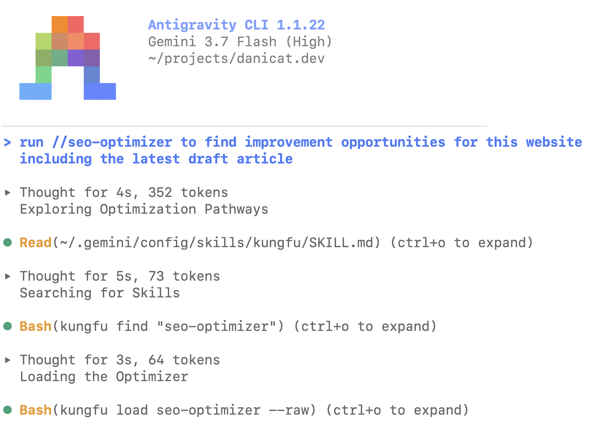

---
categories:
  - Agentic Coding
date: 2026-08-29
heroStyle: big
title: "The Pragmatic Guide to Agent Skills"
slug: "the-pragmatic-guide-to-agent-skills"
aliases:
  - "/posts/20260829-the-pragmatic-guide-to-agent-skills/"
summary: "Mastering the creation of custom Agent Skills is the ultimate developer productivity boost. Explore practical use cases across documentation, workflows, and agent traits."
description: "A pragmatic guide to creating custom Agent Skills for coding agents: explore real-world use cases across documentation, process automation, and agent traits."
tags:
  - agent-skills
  - antigravity
  - gemini-cli
  - vibe-coding
proficiencyLevel: "Intermediate"
dependencies:
  - "Antigravity 2.0"
  - "Antigravity CLI"
  - "Gemini CLI"
  - "Claude Code"
---

It might be hard to believe, but the [**Agent Skills**](https://agentskills.io) standard is not even one year old. The [original blog post by Anthropic](https://www.anthropic.com/engineering/equipping-agents-for-the-real-world-with-agent-skills) was published in October 2025, first introducing Agent Skills as a Claude Code extension before it became a proper standard in December 2025. The standard proved to be so useful that in a very short time it was adopted by all the major coding agents and agent development frameworks to equip AI models with modular instructions, deterministic scripts, and specialized domain workflows.

Fast-forward to today, most developers are familiar with skills and the advantages of the progressive disclosure model, but are they using and creating skills effectively? In this article, we are going to explore the main challenges of dealing with skills, from discovery and provenance to development and optimization.

All the skills and examples mentioned in this text were tested using Antigravity CLI and Gemini 3.7 Flash, but I encourage you to experiment with them even if you use a different harness and/or model. Without further ado, let's dive deep into the world of Agent Skills!

## Creating skills vs consuming skills

The evergreen software engineer's dilemma: should I build my own or procure something ready? There are many approaches to this problem, but I'm going to share my pragmatic view:

```goat
      +-----------------------------------------+
      |  Is this process specific to your repo  |
      |              or codebase?               |
      +-----------------------------------------+
            |                             |
       Yes  |                             |  No
            |                             v
            |                 +-----------------------+
            |                 |  Do you know a skill  |<-------------------+
            |                 |   that does the job?  |                    |
            |                 +-----------------------+                    |
            |                    |                 |                       |
            |               Yes  |                 |  No                   |
            |                    v                 v                       |
            |         +--------------------+  +------------------+         |
            |         | Passes security &  |  | Spent too much   |         |
            |         |  integrity checks? |  |  time looking?   |         |
            |         +--------------------+  +------------------+         |
            |            |              |        |            |            |
            |       Yes  |           No |    Yes |         No |            |
            |            |              |        |            v            |
            |            |              |        |    +---------------+    |
            |            |              |        |    |  Search for   |    |
            |            |              |        |    |    a skill    |    |
            |            |              |        |    +---------------+    |
            |            |              |        |            |            |
            |            |              v        v            +------------+
            |            |         +------------------+
            |            |         |  Build your own  |
            +--------------------->|      skill       |
                         |         +------------------+
                         |                   |
                         v                   v
                  +-----------------------------------+
                  |              Profit!              |
                  +-----------------------------------+
```

OK, I admit the algorithm is a bit messy, but the bottom line is: unless you have an authoritative source for the skill, or absolute trust that you are not exposing yourself to an attack vector, it is better to build your own.

The effort of building skills is quite low, so there are very few circumstances where I would advise you against it. The main one would be if you lack the domain knowledge to judge the quality of the skill, as this poses a big risk of creating an echo chamber of bad behaviour.

If you know what you are doing, building skills is the ultimate hack to unlock developer productivity with coding agents, and this is why I believe that every serious developer should master the skill of creating skills (pun intended).

## Mastering the skill of creating skills

The key to creating useful skills is all about observing agent patterns. You might not be able to come up with a skill after a single coding session, but the more you use agents and the more you observe how they behave, the more you will notice knowledge and behavioural gaps that can be filled with custom skills.

This will become more clear as I present you with some examples, but before I can talk about them, let's have a look at the different types of skills we can create:

### Level 1: Documentation

A skill that explains a particular piece of technology, augmenting or superseding the model's built-in knowledge. It is very common, for example, that models recommend obsolete libraries or SDKs, or use outdated coding patterns, just because those were prevalent in their training data. Using skills to update the model's knowledge about a piece of software is one of the most basic uses of the technology.

The typical format of a documentation skill is a single `SKILL.md` file with the updated knowledge, showing command lines, snippets of code, and external URLs. Depending on the complexity of the domain, splitting the `SKILL.md` file into separate reference and/or asset files is ideal to maximise the progressive disclosure potential.

Create this type of skill when you see your agent using obsolete patterns, outdated libraries, old SDK versions, or when it repeatedly generates sub-optimal implementations. Most manufacturer-provided skills fall into this category, like the [Google Skills](https://github.com/google/skills) repository that includes skills for most Google products.

An example of a documentation skill that I created is [ebitengineer](https://skills.danicat.dev/game-dev/ebitengineer/). This skill was designed after I noticed repeated problems while building 2D games with Ebitengine, like using the incorrect order of matrix operations, poor modularisation, lack of state management, abuse of debug text instead of production fonts and so on.

### Level 2: Process

A skill that enforces a specific process or workflow, such as performing a code review, conducting a security audit, or analysing performance metrics. This type of skill usually bundles not only knowledge but custom scripts or CLI tools to perform tasks, saving the model the effort to build them from scratch every single time you need them.

You should create process skills whenever you see yourself instructing the model to do the same task over and over, especially if there are deterministic steps that can be scripted. A few process skills that I use a lot belong to the [analytics](https://skills.danicat.dev/analytics) skill set to collect and analyse data from social networks, Google Analytics, and Google Search Console.

Optimising my online presence is an important part of my job (there is little point in producing content that no one sees), so I devised those skills to automate the tasks that I was doing manually by inspecting each platform's analytics website one-by-one. Now I have a "command centre" powered by those skills, saving precious time that I can dedicate to producing more and better content.

Look at your own process. What are the things that you do repeatedly during your work day, week or month? Create skills for those to save you precious time, improve the quality of your work, or both!

### Level 3: Traits

A trait skill is one that affects the agent's personality and/or mode of operation. 

One famous skill in this category is Matt Pocock's [`/grill-me`](https://github.com/mattpocock/skills). It got so popular that most agentic harnesses bundle one version of it out-of-the-box. The purpose of this skill is to encourage the agent to extract knowledge from the user, filling gaps that otherwise would be guessed or, even worse, hallucinated.

A few of my favourite trait-based skills are: [swarm-coding](https://skills.danicat.dev/agents/swarm-coding), [double-diamond](https://skills.danicat.dev/agents/double-diamond) and [uno-reverse](https://skills.danicat.dev/agents/uno-reverse). 

Swarm coding is the first skill I wrote to tackle orchestrating subagents. I wrote about the whole process of creating it in [The Rise of the Subagents](), so I encourage you to check that article if you are curious about it.

Double diamond is the spiritual successor of swarm coding, but includes an inception and a discovery phase. Readers familiar with Agile methodologies will recognise this technique. It is based on the principle of successive phases of divergence and convergence. You diverge to explore the problem space, and then converge into a solution. For example, when planning a major feature across this site, I can kick off the entire exploration with:

```text
/double-diamond I would like to plan phase 3 of this website. I want to improve the visualization of skill cards, add metrics, and a like/star button so we can rank skills by popularity.
```

Uno reverse is my own take on having an agent with an adversarial personality, just for the sake of breaking the echo chamber of the agents doing the implementation. The adversarial agent will criticise the implementation and look for opportunities to cut down the bloat, acting as a counter-measure to overengineering. I often use it as a sanity check during architectural reviews:

```text
Please run a /double-diamond process to refine ADR-0002. At the review phase, use an /uno-reverse agent to antagonise the proposal and present the results.
```

As you can see, these skills can be pretty powerful on their own, but they can get even more interesting when combined with each other. For example, I have lots of fun using `/grill-me` + `/double-diamond` + `/uno-reverse` on the same prompt. This makes the model ask me clarifying questions, go on a research phase to find different implementations and then criticise them to find the optimal solution.

As for the inspiration to create these skills, look for any moments in your career where you learned a (human) skill that helped you or your team improve the quality of your work. Especially since the advent of subagents, we are seeing more and more the use of managerial skills being applied to AI, and this is no coincidence. AI just happens to be as unreliable as we are when left to its own devices.

## The continuous improvement loop

Creating skills is great, but you will only really unlock the full value of skills if you are continuously improving them. My process is to do a glow-up of my skills almost every time I use them, because I often discover rough edges, gaps and bugs when I use them in a new session. Another excuse to give them a glow-up is when a new model is released, as you would assume the new model will be more capable and upgrade the skill to the best of its capabilities.

I do this so often that I created a [`/skill-optimizer`](https://skills.danicat.dev/agents/skill-optimizer) skill. This skill is based on the best practices published at [agentskills.io](https://agentskills.io), plus a little of my own taste. It ensures skills have a good progressive disclosure model, using a supporting script to estimate token counts and keep each section in a sensible size. It also optimises the skill description focusing on benefits instead of implementation details. For example, before optimisation my [search-analytics](https://skills.danicat.dev/analytics/search-analytics) skill was full of bloat on how search worked using algorithm X or Y, but this matters very little for the usability of the skill and it was a waste of space. The relevant information in this case is how to load and query the data. Everything else is wasting tokens.

Besides creating skills and optimising them on your own, there is also an automated way of doing this. It is a concept called **agent dreaming**: the process of extracting lessons from past agent sessions. In Antigravity, you can ask it to dream by using the `/learn` slash command. When you start a learning session the agent will explore the conversation history for patterns and look for ways where it can improve itself, giving you options to update context files, add or tune configuration guardrails, or generating custom skills. For example, after a long debugging sprint, you could simply run:

```text
/learn look at our debugging sessions with Ebitengine matrix transforms and state management. Extract the recurring bugs and fixes into a new documentation skill with clear anti-patterns and examples.
```

## Activation: explicit is better than implicit

I've spent more time than I would like to admit trying to fine tune descriptions to ensure skills are always activated when the model needs them. I failed in all my attempts so far. You can get to a point where models activate them more often than not, but in my experience perfect activation rates are still unachievable today.

This is why I'm importing an old adage from the Zen of Python and changing my own ways of working: explicit is better than implicit. Instead of waiting for the good will of the agent to invoke the skill I want, I tell it exactly what I want invoked and when.

In Antigravity we also have the benefit of the automatic mapping of skills to slash commands, so when I type `/swarm-coding` it immediately invokes the swarm coding skill. Slash notation turns skills into slash commands when they are the first word in a prompt, but this notation also works in the middle of prompts as hints to the model that whatever is prefixed by a slash might be a skill name. For instance, you can append `/grill-me` at the end of your prompt and the agent will trigger the `grill-me` skill as well even if technically it is not a slash command. In recent versions of the Antigravity CLI I even noticed that the harness occasionally adds `/grill-me` automatically to the end of my prompts when my commands are relatively complex or ambiguous.

## The problem of too many skills

Once you embrace the world of skills, you will eventually get into this situation. As much as the progressive disclosure model is great, it will still suffer from the same fate of context bloat as MCP servers if you keep installing more and more.

There are two ways of improving this, one that requires active work from you and the other that employs a "higher level of abstraction".

The first one is simple: do not install skills globally unless absolutely necessary. Skills can either be installed for your user (they will live in your home folder, usually at `~/.agents/skills`), or to a workspace (project level, in `<project-dir>/.agents/skills`).

This solution works at a small to medium scale, but starts posing problems if you have lots of projects with lots of skills in them. How do you keep them all up to date? How do you ensure an improvement in one skill is reflected across all other clients of that skill? Also, should `.agents` be committed with the repo or not?

I think the optimal solution to this problem is a combination of centralisation (or federation) and tracking provenance. The first part of the solution is a skill catalog. While typical skill sharing relies on git clones or copy-pasting folders, the official Agent Skills standard leaves remote discovery and distribution open to tooling. To solve this, I created an online catalog manifest for `skills.danicat.dev` that exposes an index over the web. You can inspect the live catalog manifest here: [https://skills.danicat.dev/catalog.json](https://skills.danicat.dev/catalog.json).

A skill catalog solves the problem of discoverability of skills. The idea is that you can point your agents to the catalog and they will be immediately aware of the available skills without needing to install them. This doesn't solve the context bloat problem though, unless you have a proper "find skill" procedure that skips loading the entire catalog every time you are looking for a new skill.

The catalog solves one direction of the information flow - from catalog to skill - but keeping skills up-to-date requires the reverse direction - from skill to catalog. This is what I have been calling "skill provenance": the source of the skill. The agent skill specification is not prescriptive about provenance, but there are two ways of managing this: 1) an external skill manager that tracks the source of every skill you install, or 2) adding catalog information to the skill metadata. I believe the second option is more elegant as it is "declarative": no need to figure out what magic is happening under the hood, what you see is what you get. This is a typical example of frontmatter in my skill catalog:

```yaml
---
name: swarm-coding
description: >
  Orchestrates multi-agent hierarchical swarms using a divide-and-conquer architecture for complex, multi-system, or orthogonal engineering initiatives (e.g., concurrent backend, frontend, database, QA). Manages hierarchical Lead Agents and Specialists, disjoint work allocations, and strict parent-child communication. Activate whenever the user mentions 'swarm', requests multi-agent team coordination, or needs context isolation across multiple technical domains.
license: Apache-2.0
metadata:
  category: agents
  tags: "swarm, subagents, parallel, orchestration, strategy, complexity, coordination"
  author: Daniela Petruzalek (daniela@danicat.dev)
  version: "0.2.0"
  catalog: https://skills.danicat.dev
---
```

`name`, `description`, `license` and `metadata` are the standard fields defined by the spec. While `metadata` is loosely defined, I decided to follow the recommendation of `version` and `author` as standard fields. My own extensions are `category`, `tags` and `catalog`. Category and tags help me with discoverability and classification, while with `catalog` I can track provenance. This makes it particularly simple to implement a skill manager that keeps my skills up to date: they just need to hit the catalog at the given address and check if the skill version has been updated or not.

If you assume that agents will only eventually (as opposed to every session) browse the catalog to cherry pick and install skills, we might overlook the context bloat of loading the entire catalog, but in my mind the ideal scenario would allow a slightly smarter dynamic. Enter `kungfu`.

## "I know kung fu."

[`kungfu`](https://github.com/danicat/kungfu) is the CLI tool I developed to help me manage my skills. The name comes from the classic scene in *The Matrix* where Neo has Kung Fu (the martial art) "installed" into his brain. This is the dream I had for my agents: to install on-demand knowledge at any point in time.

I have a `kungfu` skill that teaches the agent how to use the `kungfu` CLI and this is the only skill I need. If the agent needs a new skill, they can use `kungfu find` to search the catalog based on name, category, tags or description, with some leeway for typos using Levenshtein distance and "did you mean?" hints. Find will return a list of best matches ranked by score, and if the agent needs any of the skills listed, it can either load them just-in-time (JIT) via `kungfu load` or learn it permanently via `kungfu learn` (installing either globally or to the workspace). The image below shows the JIT loading flow:



`kungfu` will keep track of all the skills it installs and you can check for the available skills (installed or online) via `kungfu list`. `kungfu update` takes care of updating skills that have newer versions server-side, while providing some guardrails to not override local customisations.

Since `kungfu` relies on this `catalog.json` convention and my frontmatter metadata extensions, it requires registries to expose a catalog manifest or skills to declare their origin. To make it work seamlessly with arbitrary skill repos in the wild, I added local state tracking in `~/.config/kungfu/state.json` to record skill origins regardless of how a skill was installed.

You might be thinking: why bother adding the catalog to metadata if you can keep the manifest? One, because I like declarative things and two, because this allows reconciliation and lifecycle management even if you didn't use `kungfu` to learn a skill.

## Wrapping up

Agent Skills are one of the most effective ways to bridge the gap between static foundation models and your actual day-to-day engineering workflows. Whether you start by building a simple documentation skill to banish outdated SDK patterns, automate your repetitive analytical chores with process skills, or explore trait-based agent swarms, the investment pays off fast.

Feel free to borrow ideas from [skills.danicat.dev](https://skills.danicat.dev) or use [`kungfu`](https://github.com/danicat/kungfu) to manage and load them on demand, but whichever path you choose, the most important thing is that you keep refining your processes to achieve the full potential of agentic coding.
