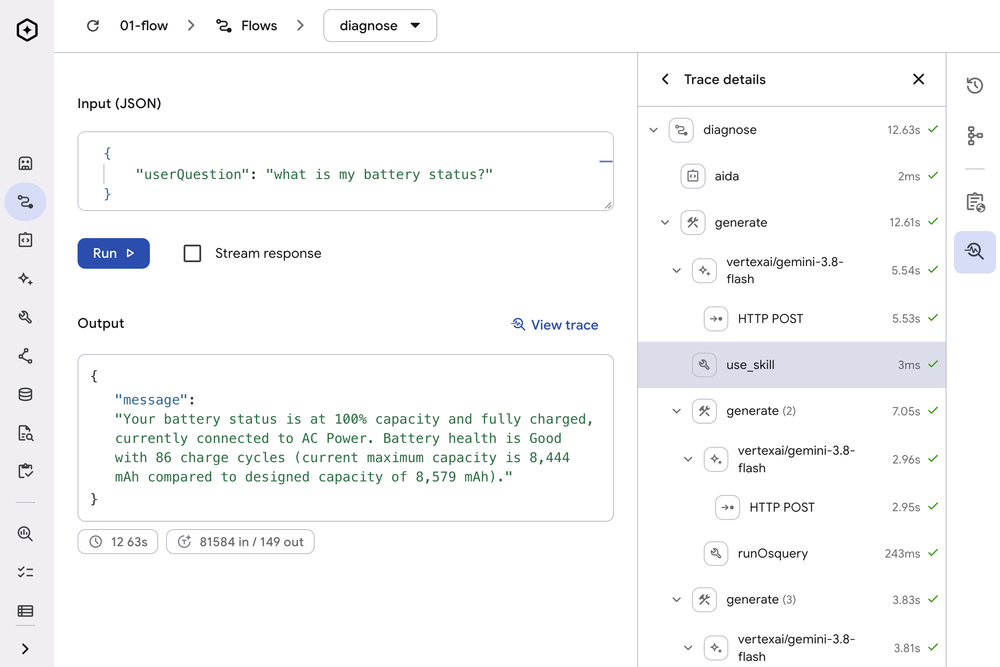

In the [previous chapter of Gemini for Go Developers](), we explored how to build an agent in Go using three different libraries: the [GenAI SDK](https://pkg.go.dev/google.golang.org/genai), [Genkit](https://genkit.dev), and [ADK](https://adk.dev). We kept that agent simple on purpose so we could compare the ergonomics of each development style side by side. Now it is time to go deeper into each framework.

In this article, we will focus on building agentic backends with Genkit. We will cover the development process end to end, from setting up the development environment to deploying your Genkit app to the cloud. We also need to touch on the theory behind the core elements of Genkit (e.g. flows, tools, prompts, plugins, middleware, etc.), but to ensure we stay grounded in what really matters we are going to pair all these concepts with a practical application. For this purpose we are going to revisit and modernise AIDA, the AI Diagnostic Agent that I introduced in this blog last year.

## Revisiting AIDA: the AI Diagnostic Agent

AIDA was the [first agent I ever created](). Its purpose is to diagnose computer problems by querying the operating system via an open-source tool called [osquery](https://osquery.io/). AIDA is a bit more than a year old now, and even though it went through a few updates over the months, I never really questioned its architecture until today.

When AIDA was created, models were at a different level of capability and techniques like agent skills had not been invented yet. To improve response quality, I had to inject on-demand schema and query knowledge into the agent context using a [rudimentary RAG solution powered by SQLite](). It's funny how something that not so long ago used to be cool and "state of the art" now feels like old and clunky. It was not only the RAG though, the entire codebase of AIDA was hacked instead of engineered. Even worse, everything was done with early stage "vibe coding".

I have been saying this for over a decade, but now it is more true than ever: if your codebase is holding you back, nuke it and start over. There is something about starting over after enduring the growth pains of a codebase that always makes v2 (or N+1) better: you learn what not to do, you optimise, you simplify. The best part? Nowadays you can do three versions of something before lunch. In the past a rewrite used to take months, and a lot of political capital.

Rewriting AIDA in Genkit will not only give us an opportunity to bring her up to modern standards, but also massively improve the maintainability and readability of the code. AIDA will compile to a single binary that can work as a standalone app or a web server that can be deployed to the cloud.

## Setting up your coding agent and local workflow

Before writing any application code we need two things: the local `genkit` CLI for the development UI and command line utilities, and the Agent Skills that teach your coding agent how Genkit Go works.

### Genkit CLI and Dev UI

To install the `genkit` CLI run the official install script:

```sh
curl -sL cli.genkit.dev | bash
```

The `genkit` CLI is the backbone of local development in Genkit Go. If you run your program directly with `go run .`, it works as a normal Go binary, but by prefixing your run command with `genkit start --` you will have access to the **Genkit Developer UI** (defaults to `http://localhost:4000`) where you can visually inspect and test the components of your Genkit program individually:

```sh
genkit start -- go run .
```

In the Dev UI, you can test registered flows, prompts, and agents interactively and inspect traces for prompts, tool calls, token usage, and latency.

Besides the Dev UI, the `genkit` CLI also provides command line helpers for executing flows, visualising traces and browsing the documentation. This last one is particularly useful to prevent model hallucination during the implementation phase.

Here are some examples:

```sh
# Run a specific flow once from the terminal and exit (--stream or --wait optional)
genkit flow:run diagnose '{"userQuestion": "how is my disk usage?"}' --non-interactive -- go run .

# Browse and read the embedded Genkit Go documentation offline
genkit docs:list go
genkit docs:read go/middleware.md
```

### Recommended skills

The gold standard for SDKs nowadays is to ship them with official agent skills and Genkit is no different. If you are developing a Genkit Go program this is the one you are looking for:

- [`developing-genkit-go`](https://github.com/genkit-ai/skills): the official Genkit Go skill covering flows, dotprompt, built-in middleware, and experimental agents.

Since we are developing with Gemini models, it is also useful to install the `gemini-api-dev` skill:
- [`gemini-api-dev`](https://github.com/google-gemini/gemini-skills): the official Gemini skill for current model IDs and thinking configuration.

You can install them into your workspace using the Vercel [`skills` CLI](https://github.com/vercel-labs/skills):

```sh
npx skills add genkit-ai/skills --skill developing-genkit-go
npx skills add google-gemini/gemini-skills --skill gemini-api-dev
```

Or register the catalogs with [`kungfu`](https://github.com/danicat/kungfu) for just-in-time (JIT) loading:

```sh
kungfu catalog add genkit-ai/skills
kungfu catalog add google-gemini/gemini-skills
```

If you prefer using an MCP server instead of skills, the CLI also ships an [MCP server](https://genkit.dev/docs/go/mcp-server/) (`genkit mcp`). These days I personally have been leaning more towards skills, but MCPs still have value for certain niche use cases (e.g. documentation retrieval).

## Core concepts

Genkit is an open-source framework for generative AI applications originally created by the Firebase team before growing into its own project. While its original language is JS, Genkit Go feels surprisingly idiomatic for seasoned Go developers, even if it still has a few rough edges here and there. The typical Genkit program won't be much different than a traditional web service, thanks to adapters like `genkit.Handler` and familiar constructs like middleware and strongly typed flows and prompts.

### Flows

The fundamental unit in Genkit is a **flow**: a strongly typed function that wraps generative AI calls along with any pre- or post-processing logic. Let's start AIDA as a single-shot diagnostic flow equipped with a tool to query the operating system via `osqueryi`:

```go
type AIDARequest struct {
	OS           string `json:"os,omitempty" jsonschema_description:"The target operating system (defaults to runtime.GOOS)"`
	UserQuestion string `json:"userQuestion" jsonschema_description:"The diagnostic question to investigate"`
}

type AIDAResponse struct {
	Message string `json:"message" jsonschema_description:"The diagnostic findings and recommendations"`
}

type OsqueryInput struct {
	Query string `json:"query" jsonschema_description:"The SQL query to execute in osquery."`
}

g := genkit.Init(ctx,
	genkit.WithPlugins(&googlegenai.VertexAI{}),
	genkit.WithDefaultModel("vertexai/gemini-3.8-flash"),
)

runOsquery := genkit.DefineTool(g, "runOsquery", "Runs a system inspection query using osquery.",
	func(ctx *ai.ToolContext, in OsqueryInput) (string, error) {
		out, err := exec.CommandContext(ctx, "osqueryi", "--json", in.Query).CombinedOutput()
		if err != nil {
			return "", fmt.Errorf("osqueryi failed: %w: %s", err, out)
		}
		return string(out), nil
	},
)

diagnoseFlow := genkit.DefineFlow(
	g,
	"diagnose",
	func(ctx context.Context, req AIDARequest) (AIDAResponse, error) {
		if req.OS == "" {
			req.OS = runtime.GOOS
		}
		resp, err := genkit.Generate(ctx, g,
			ai.WithSystem(fmt.Sprintf("You are the Emergency Diagnostic Agent for diagnosing %s operating system failures. Your name is AIDA.", req.OS)),
			ai.WithPrompt(req.UserQuestion),
			ai.WithTools(runOsquery),
		)
		if err != nil {
			return AIDAResponse{}, fmt.Errorf("diagnose flow failed: %w", err)
		}
		return AIDAResponse{Message: resp.Text()}, nil
	},
)
```

`genkit.DefineTool` registers the `runOsquery` tool using the `OsqueryInput` struct to generate its JSON schema, while `genkit.DefineFlow` registers the flow by name with a callback function. If you look at the callback signature, it feels very similar to a typed HTTP handler — it takes a `context.Context` and a strongly typed request struct, and returns a typed response alongside a standard Go `error`.

Notice the `g` variable passed as the first argument to `DefineTool`, `DefineFlow`, and `Generate`. `g` is a `*genkit.Genkit` instance, which acts as the central registry for all flows, prompts, tools, models, and middleware in your program. You initialise `g` once in `main` with `genkit.Init` and pass it explicitly.

I'll be honest, I'm not a huge fan of `genkit.WithDefaultModel`, as I prefer code to be explicit, but it does help reducing a bit of boilerplate if you are defining many flows. We are going to see a better option to hardcoding models in flows when discussing prompts.

`genkit.Init` sets up both the runtime registry and the observability stack. Every model and tool call inside a flow is automatically recorded as a child span under the flow's trace. If your flow also performs custom pre- or post-processing — like querying a database or calling an external API — wrapping that logic in `genkit.Run` records it as its own named sub-step in the trace waterfall.

For development purposes you can run a flow via the CLI or in the Dev UI. In production, you may invoke flows as a regular Go function call (e.g. `myFlow.Run`), or exposed as an HTTP endpoint. Turning a flow into an HTTP handler takes a single line with `genkit.Handler`:

```go
mux := http.NewServeMux()
mux.HandleFunc("POST /diagnose", genkit.Handler(diagnoseFlow))

port := os.Getenv("PORT")
if port == "" {
	port = "3400"
}

// Note: "server" requires the server plugin:
// import "github.com/firebase/genkit/go/plugins/server"
log.Fatal(server.Start(ctx, "0.0.0.0:"+port, mux))
```

If you want to expose every flow registered in your application at once, you can iterate over `genkit.ListFlows(g)`:

```go
mux := http.NewServeMux()
for _, flow := range genkit.ListFlows(g) {
	mux.HandleFunc("POST /"+flow.Name(), genkit.Handler(flow))
}
log.Fatal(server.Start(ctx, "0.0.0.0:"+port, mux))
```

Please note that `genkit.Handler` performs no authentication of its own, so wrap public endpoints in your standard `net/http` auth middleware.

### Prompts

Hardcoding prompts and model configuration in the flow code works for small projects, but it can get hard to maintain them as the project grows. Even if coding agents are doing most of the heavy work these days, we should not throw away years of engineering best practices, and code organisation is one of them.

Genkit has support for prompt templates using a format called [dotprompt](https://genkit.dev/docs/go/dotprompt/) (`*.prompt` files). Prompts in `dotprompt` may contain more than just the instructions for the model; for example, they may include metadata for selecting and configuring the model, schema definitions, system instructions, and conversation history.

Extracting AIDA's prompt, tools, and model configuration out of `diagnoseFlow` into `prompts/aida.prompt` looks like this:

```markdown
---
model: vertexai/gemini-3.8-flash
tools:
  - runOsquery
config:
  thinkingConfig:
    thinkingLevel: low
input:
  schema:
    os: string
    userQuestion: string
output:
  format: json
  schema:
    message: string
---
{{role "system"}}
You are the Emergency Diagnostic Agent for diagnosing {{os}} operating system failures. Your name is AIDA.

{{role "user"}}
{{userQuestion}}
```

By default, `genkit.Init` automatically loads `.prompt` files from `./prompts` in your working directory. If you prefer to distribute your agent as a single binary, you can embed your `prompts` directory directly into the binary with `//go:embed` and pass it to `genkit.WithPromptFS`:

```go
import "embed"

//go:embed prompts/*
var promptsFS embed.FS

func main() {
	g := genkit.Init(context.Background(), genkit.WithPromptFS(promptsFS))
	// ...
}
```

You can look up prompts in code via `genkit.LookupPrompt` and invoke them with `myPrompt.Execute`:

```go
aida := genkit.LookupPrompt(g, "aida")
resp, err := aida.Execute(ctx, ai.WithInput(map[string]any{
	"os":           runtime.GOOS,
	"userQuestion": "how is my disk usage?",
}))
```

If you have been writing Go for a while, that `map[string]any` probably bothers you as much as it bothers me. Fortunately, Genkit lets us bind the `AIDARequest` and `AIDAResponse` structs we defined earlier directly to `aida.prompt` using **data prompts** (`genkit.LookupDataPrompt`) and `genkit.DefineSchemaFor`:

```go
// In prompts/aida.prompt, reference the Go types by name:
//
// input:
//   schema: AIDARequest
// output:
//   schema: AIDAResponse
//
// Register both schemas with Genkit so the prompt file can resolve them:
genkit.DefineSchemaFor[AIDARequest](g)
genkit.DefineSchemaFor[AIDAResponse](g)

aida := genkit.LookupDataPrompt[AIDARequest, *AIDAResponse](g, "aida")
resp, _, err := aida.Execute(ctx, AIDARequest{
	OS:           runtime.GOOS,
	UserQuestion: "how is my disk usage?",
})
// resp is of type *AIDAResponse
// Note: The second return value is the raw *ai.ModelResponse
```

With `DefineSchemaFor` and `LookupDataPrompt`, you define your schema once in Go and keep full compile-time type safety from input to parsed output.

### Plugins

You extend Genkit with packages under the `plugins/` namespace. While the most common case for a plugin is to register a model family, we also have plugins for broader capabilities like `server` and `middleware`. `server` is a special case in the sense it doesn't need to be registered to be useful, but most plugins will be initialised in the `genkit.Init` call:

```go
import (
	"github.com/firebase/genkit/go/genkit"
	"github.com/firebase/genkit/go/plugins/googlegenai"
	"github.com/firebase/genkit/go/plugins/middleware"
)

g := genkit.Init(ctx,
	genkit.WithPlugins(
		&googlegenai.VertexAI{},  // Gemini via Vertex AI
		&middleware.Middleware{}, // Registers Retry, Fallback, Skills, etc.
	),
)
```

The concept of middleware should be familiar to most Go developers, but it is important to single out this plugin as it is the gateway for critical capabilities like fallbacks, retries and agent skills. Let's have a deeper look at it next.

### Middleware and Agent Skills

AIDA can already execute `osquery` commands through the `runOsquery` tool we defined earlier, but it still relies on the model's general training data to guess which tables and columns exist on each operating system (`darwin`, `linux`, and `windows`). To give AIDA accurate schema knowledge, we will be providing one skill for each OS in the `./skills` folder. These skills were generated by giving Antigravity the link to the [osquery repo](https://github.com/osquery/osquery) and asking it to generate operating system specific skills based on the table availability. The skills will include the tables and respective schemas.

Genkit attaches middleware to generation calls using `ai.WithUse`, and the `plugins/middleware` package provides built-in implementations for retries, model fallbacks, and [Agent Skills](https://agentskills.io):

```go
resp, err := genkit.Generate(ctx, g,
	ai.WithSystem(fmt.Sprintf("You are AIDA, a %s operating system diagnostic assistant.", runtime.GOOS)),
	ai.WithPrompt("My machine is running out of file descriptors. How do I inspect open files with osquery?"),
	ai.WithTools(runOsquery),
	ai.WithUse(
		&middleware.Retry{MaxRetries: 3, InitialDelayMs: 1000, BackoffFactor: 2},
		&middleware.Fallback{
			Models: []ai.ModelRef{
				googlegenai.ModelRef("vertexai/gemini-3.5-flash-lite", nil),
			},
		},
		&middleware.Skills{
			SkillPaths: []string{"./skills"},
		},
	),
)
```

Like HTTP middleware, `ai.WithUse` composes in order: placing `Retry` before `Fallback` retries the primary model before falling back to the secondary model.

When you point `&middleware.Skills{}` at `./skills`, Genkit scans each subdirectory, injects the skill descriptions into the system prompt, and registers a `use_skill` tool so AIDA can load the right OS schema and query patterns on demand.

Please note that, unlike `dotprompt`, at the moment the `Skills` middleware does not support embedding filesystems, so you still need to resort to bundling a skills directory into your deployment.

Because we registered `&middleware.Middleware{}` during `genkit.Init`, we can also declare these middlewares directly inside `prompts/aida.prompt`:

```yaml
---
model: vertexai/gemini-3.8-flash
tools:
  - runOsquery
use:
  - name: genkit-middleware/retry
    config:
      maxRetries: 2
  - genkit-middleware/skills
---
```

For advanced use cases, you can also write custom middleware by implementing the `ai.Middleware` interface to intercept and wrap generation, model, or tool calls with your own logic.

### The developer UI

You can find the complete code up to this point in the companion repository under [`github.com/danicat/gemini-for-go-developers/part-4/01-flow`](https://github.com/danicat/gemini-for-go-developers/tree/main/part-4/01-flow).

To test AIDA in the Genkit Developer UI, launch the application from that directory with `genkit start`:

```sh
export GOOGLE_CLOUD_PROJECT=your-project-id
export GOOGLE_CLOUD_LOCATION=global # required for Gemini 3.x
genkit start -- go run .
```

Open `http://localhost:4000`, select the **diagnose** flow from the sidebar, and run it with the following test payload:

```json
{
  "userQuestion": "what is my battery status?"
}
```

Here is the output of this prompt on my machine (observe the trace on the right panel showing that the skill was activated):



## Stateful agents (experimental)

I typically like to stay clear of experimental features, but this one is an exception. While it's perfectly possible to implement agents based on flows alone, developing more complex patterns — like chatbots, serial agents and parallel agents — does take a bit of effort crafting the right patterns using goroutines, synchronisation, error handling and others.

The introduction of the agent abstraction simplifies this process by providing us with a much more ergonomic API focused on the declarative aspect of agent creation instead.

### Defining an agent

Because the API is still experimental, you need to enable it with `genkit.WithExperimental()` when initialising Genkit. Here is how we turn AIDA into a stateful, multi-turn terminal agent backed by a session store:

```go
import (
	aix "github.com/firebase/genkit/go/ai/exp"
	"github.com/firebase/genkit/go/ai/exp/localstore"
	genkitx "github.com/firebase/genkit/go/genkit/exp"
)

g := genkit.Init(ctx,
	genkit.WithExperimental(),
	genkit.WithPlugins(&googlegenai.VertexAI{}, &middleware.Middleware{}),
)

store := localstore.NewInMemorySessionStore[struct{}]()

aida := genkitx.DefineAgent(g, "aida",
	aix.InlinePrompt{
		ai.WithModelName("vertexai/gemini-3.8-flash"),
		ai.WithSystem(fmt.Sprintf("You are AIDA, a %s operating system diagnostic assistant. Use runOsquery to inspect the host.", runtime.GOOS)),
		ai.WithTools(runOsquery),
		ai.WithUse(&middleware.Skills{SkillPaths: []string{"./skills"}}),
	},
	aix.WithSessionStore(store),
)

// Interactive terminal session maintaining state across turns
scanner := bufio.NewScanner(os.Stdin)
var sessionID string

fmt.Print("AIDA> ")
for scanner.Scan() {
	input := strings.TrimSpace(scanner.Text())
	if input == "" || input == "exit" {
		break
	}

	var opts []aix.InvocationOption[struct{}]
	if sessionID != "" {
		opts = append(opts, aix.WithSessionID[struct{}](sessionID))
	}

	out, err := aida.RunText(ctx, input, opts...)
	if err != nil {
		fmt.Fprintf(os.Stderr, "error: %v\n", err)
		fmt.Print("AIDA> ")
		continue
	}

	sessionID = out.SessionID
	fmt.Printf("\n%s\n\nAIDA> ", out.Message.Text())
}
```

Storing `out.SessionID` and passing it into subsequent turns preserves the conversation history across the session. The `[struct{}]` type parameter simply tells Genkit that we only want to persist the message history without attaching custom session state.

The same techniques used to improve the code around flows can be used with agents. To avoid hardcoding the prompts, you can use `genkitx.DefinePromptAgent` to bind `prompts/aida.prompt` directly to the agent.

To expose AIDA over HTTP so a remote frontend can connect to it, `genkitx.AllAgentRoutes` mounts turn, snapshot, and abort endpoints onto standard Go routers:

```go
mux := http.NewServeMux()
for _, route := range genkitx.AllAgentRoutes(g) {
	mux.HandleFunc(route.Pattern(), route.Handler())
}
```

You can find the complete stateful agent implementation in the companion repository under [`github.com/danicat/gemini-for-go-developers/part-4/02-agent`](https://github.com/danicat/gemini-for-go-developers/tree/main/part-4/02-agent).

### Multi-agent delegation

There are cases where you will need more than one agent to perform a task. Benefits of multi-agent architecture include separation of concerns — to improve agent attention and reduce context rot — and parallelisation — to improve response times.

Using the experimental `middlewarex.Agents` middleware in Genkit, we can split AIDA's investigative work between two specialists while keeping `aida` as the main coordinator persona:

- **`inspector`**: Focuses exclusively on querying host telemetry via `runOsquery` and the OS-specific `osquery` skills.
- **`researcher`**: Uses Google Search grounding to look up unfamiliar processes, binaries, error messages, and CVEs on the web without bloating AIDA's main conversation history.

```go
// requires:
// import (
// 	"google.golang.org/genai"
// 	middlewarex "github.com/firebase/genkit/go/plugins/middleware/exp"
// )

inspector := genkitx.DefineAgent(g, "inspector",
	aix.InlinePrompt{
		ai.WithModelName("vertexai/gemini-3.8-flash"),
		ai.WithSystem(fmt.Sprintf("Inspect %s system telemetry using osquery and report diagnostic findings.", runtime.GOOS)),
		ai.WithTools(runOsquery),
		ai.WithUse(
			&middleware.Retry{MaxRetries: 5},
			&middleware.Skills{SkillPaths: []string{"./skills"}},
		),
	},
	aix.WithDescription[struct{}]("Inspects host metrics, running processes, and system configuration using osquery."),
)

researcher := genkitx.DefineAgent(g, "researcher",
	aix.InlinePrompt{
		ai.WithModelName("vertexai/gemini-3.8-flash"),
		ai.WithSystem("Research unfamiliar processes, binaries, error messages, and CVEs using Google Search and report concise findings."),
		ai.WithConfig(&genai.GenerateContentConfig{
			Tools: []*genai.Tool{
				{GoogleSearch: &genai.GoogleSearch{}},
			},
		}),
	},
	aix.WithDescription[struct{}]("Searches the web for information on unfamiliar processes, binaries, error codes, and CVEs."),
)

aida := genkitx.DefineAgent(g, "aida",
	aix.InlinePrompt{
		ai.WithModelName("vertexai/gemini-3.8-flash"),
		ai.WithSystem(fmt.Sprintf("You are AIDA, a %s operating system diagnostic assistant. Delegate host inspection to inspector and web research to researcher, then synthesize findings for the user.", runtime.GOOS)),
		ai.WithUse(
			&middleware.Retry{MaxRetries: 5},
			&middlewarex.Agents{
				Agents:         []aix.AgentRef{inspector.Ref(), researcher.Ref()},
				MaxDelegations: 5,
			},
		),
	},
	aix.WithSessionStore(store),
)
```

Delegation runs synchronously by default, though you can set `Async: true` on `middlewarex.Agents` if you want AIDA to kick off long-running specialist tasks in the background and join their results across turns.

One thing to keep in mind is the latency trade-off. When I timed the exact same `"what is my battery status?"` query against both versions (with `thinkingLevel` set to `low`), the single-agent version (`02-agent`) finished in **9.56s** across 3 LLM calls, while this multi-agent version (`03-multi-agent`) took **17.02s** across 5 LLM calls. The per-call latency is basically identical (~3.3s), so the extra ~7.5 seconds come purely from the two extra coordinator round-trips as `aida` delegates to `inspector` and then summarises its report.

Much like in parallel programming, the coordination overhead for a small *N* can make a simple task slower. For a toy query, a single agent is faster; in a real-world system, however, splitting an "uber-agent" into focused sub-agents is often worth those extra round-trips to isolate noisy tool outputs, optimise context usage, and improve overall response quality.

You can find the complete multi-agent example in the companion repository under [`github.com/danicat/gemini-for-go-developers/part-4/03-multi-agent`](https://github.com/danicat/gemini-for-go-developers/tree/main/part-4/03-multi-agent).

## Deploying to production

### Runtimes

Because a Genkit Go application compiles to a standard Go binary using `net/http`, there is no proprietary runtime lock-in. This means that basically any platform you use to host your HTTP servers is fair game for Genkit apps.

My first preference is always a serverless container runtime. At Google, I use primarily **Google Cloud Run**, only choosing more complex platforms (like **Google Kubernetes Engine (GKE)** or **Gemini Enterprise**) when I hit a critical blocker that requires a feature that Cloud Run doesn't give to me.

It is also worth saying that in the past these types of decisions used to be more important than they are today. Replatforming took a lot of effort, so people had the tendency of wanting to "get it right" from the beginning. With coding agents we can adapt an app to a new platform in a matter of days (if not hours), so there are no more excuses to add complexity early to a project.

This is the theory. In practice, over the last year I never found a case that I couldn't do with Cloud Run. It is simply that convenient! Things will be a bit different when we discuss ADK in a future article, as the Gemini Enterprise ecosystem does have some synergies with ADK that are worth paying attention to.

Now, typically agents — especially Gemini-based ones like Antigravity — don't need help deploying to Cloud Run. But if your agent is being grumpy, you can always install the Cloud Run skill from [github.com/google/skills](https://github.com/google/skills/tree/main/skills/cloud/cloud-run-basics) to give it a nudge.

### Observability

During local development, `genkit start` records full execution traces and structured logs in `.genkit/traces` (which you should add to `.gitignore`) so you can inspect them in the Dev UI. In production, you want that same visibility into token usage, latency, and step-by-step traces in your monitoring backend.

Since Genkit is built on [OpenTelemetry](https://opentelemetry.io/), you have two main options: if you are deploying to Google Cloud, the `googlecloud` plugin (or the `firebase` plugin, which runs the same exporter under the hood) sends everything to Cloud Logging, Cloud Trace, and Cloud Monitoring. If your team uses another backend like Datadog, Grafana, or Honeycomb, you can attach a standard OTLP exporter directly to the Genkit tracer provider instead.

For a typical Cloud Run deployment, enable the Google Cloud exporter before calling `genkit.Init`:

```go
import "github.com/firebase/genkit/go/plugins/googlecloud"

func main() {
	ctx := context.Background()

	googlecloud.EnableGoogleCloudTelemetry(&googlecloud.GoogleCloudTelemetryOptions{
		// Raw prompts and responses are logged by default; disable this for sensitive data:
		DisableLoggingInputAndOutput: true,
		// Set to true if you want to test Cloud export locally under `genkit start`:
		ForceDevExport: false,
	})

	g := genkit.Init(ctx,
		// if you are deploying to GCP, auth via Gemini Enterprise (aka Vertex AI) is preferred
		genkit.WithPlugins(&googlegenai.VertexAI{}),
	)
	// ...
}
```

If you prefer an OTLP backend instead, register a standard OpenTelemetry span processor before `genkit.Init` and `defer` its shutdown function:

```go
import (
	"context"
	"log"

	"github.com/firebase/genkit/go/core/tracing"
	"go.opentelemetry.io/otel/exporters/otlp/otlptrace/otlptracegrpc"
	sdktrace "go.opentelemetry.io/otel/sdk/trace"
)

func registerOTLP(ctx context.Context) func(context.Context) error {
	// Configured via standard OTEL_EXPORTER_OTLP_* environment variables.
	exp, err := otlptracegrpc.New(ctx)
	if err != nil {
		log.Fatalf("failed to build OTLP exporter: %v", err)
	}

	tp := tracing.TracerProvider()
	tp.RegisterSpanProcessor(sdktrace.NewBatchSpanProcessor(exp))
	return tp.Shutdown
}
```

## Conclusions

To be honest, while this exercise of rebuilding AIDA allowed us to touch most of the core functionality of Genkit, this is far from being the ultimate deep dive I was planning to do. That said, the problem is of the good kind: Genkit has so many interesting features that it is impossible to talk about all of them in a single article. This is why I decided to focus this article on the backend aspect of agent design, and I reserved frontend with A2UI and interaction design for the next article.

Nevertheless, this article not only showcases what Genkit is capable of, but it also shows us how the industry itself evolved in the past 12 months or so. What previously required a custom RAG pipeline, an embedding model and hundreds of lines of Python code of questionable quality (this is not a criticism of Python, it is criticism of my own code), now can be solved with type-safe Go and a call to the agent skills middleware. I particularly love how snappy it feels to have a compiled agent, especially when paired with a fast model like Gemini 3.8 Flash.

I don't want to make this a Python versus Go piece, and won't try to convince you to use one or the other, but if you are planning to build agents in Go, for whatever reason it might be, I highly recommend Genkit. For all the reasons you saw in this article, plus the ones I will cover next time, and all the others I haven't even discovered yet. :)
