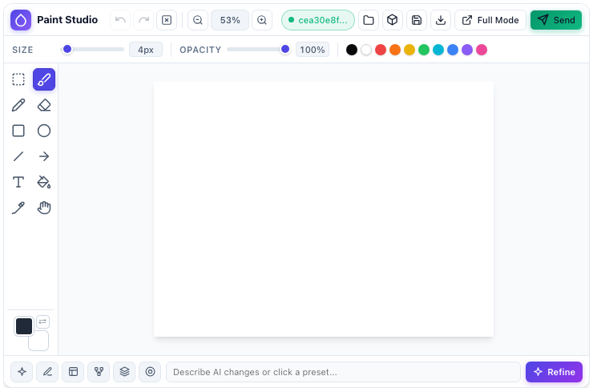
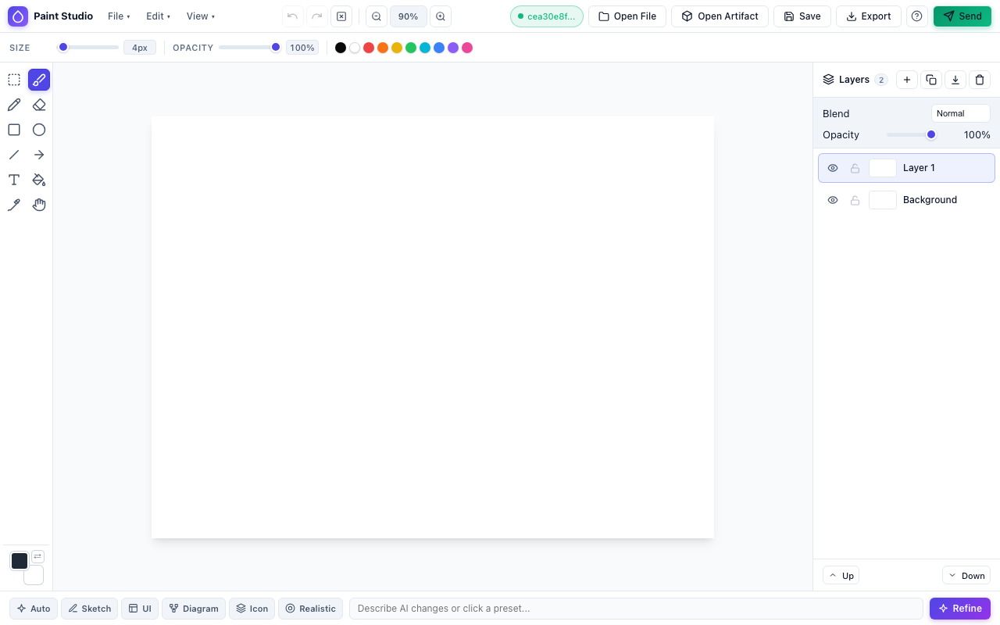

When I wrote [The Hitchhiker's Guide to Antigravity 2.0](), I mentioned that the biggest mental shift in the new desktop application was the removal of the traditional code editor in favour of a conversation-centric interface. I also promised to report back once I started pushing the plugin system beyond basic prompt packaging.

Living inside an agent manager for a few months teaches you where text excels and where it gets in the way. Natural language is great for describing state machines, refactoring Go packages, or reviewing pull requests. It is terrible when you want to tell an agent, *"Move this button over there,"* or when you want to sketch a rough concept for a 2D game sprite before generating assets. Sometimes a five-second scribble or a red arrow on a screenshot replaces three paragraphs of prompt engineering.

That friction led me to build [**Paint Studio (`agy-paint-studio`)**](https://github.com/danicat/agy-paint-studio): a multi-layer drawing canvas, layered `.psd` editor, and [Gemini](https://ai.google.dev/) image refinement studio that runs directly inside [Google Antigravity](https://antigravity.google).

Building it turned into a great tour of Antigravity's extensibility model — specifically **sidecars**, **UI extensions**, and **inline generative UI**. Along the way, I hit a few blank-screen debugging mysteries around sandboxed iframes and custom `plugin://` origins that are worth sharing if you plan to build your own visual tools.

## How Antigravity plugins, sidecars, and UI extensions fit together

If you have built [Agent Skills]() or [Model Context Protocol](https://modelcontextprotocol.io) (MCP) servers before, you are already familiar with how agents acquire instructions and call tools. Antigravity plugins can bundle those, but they also introduce **sidecars**: supervised background processes that Antigravity starts, monitors, and restarts automatically alongside your workspace.

A sidecar becomes a **UI extension** when its manifest declares a web interface. Instead of communicating only with the model through tool calls, a UI extension serves an interactive web panel that docks into the right-hand auxiliary pane next to your conversation.


flowchart LR
    subgraph Plugin["Plugin (~/.gemini/config/plugins/agy-paint-studio)"]
        Manifest["plugin.json"]
        Skill["skills/paint-studio/SKILL.md"]
        SidecarManifest["sidecars/studio/sidecar.json"]
    end

    subgraph Runtime["Antigravity Host & Sidecar Runtime"]
        Sidecar["Node.js Sidecar Process<br/>(SidecarApp on 127.0.0.1:&lt;port&gt;)"]
        Preload["/preload.js<br/>(window.sidecar bridge)"]
        AgentAPI["Antigravity Agent API<br/>(send-message / metadata)"]
    end

    subgraph Views["Four User Views"]
        AuxPane["Auxiliary Side Pane<br/>(plugin:// origin)"]
        FileViewer["Custom Image & .psd File Viewer<br/>(?file=/path/to/file)"]
        InlineChat["Inline Chat Widget<br/>(&lt;agent-embed&gt;)"]
        FullMode["Full Browser Workspace<br/>(http://127.0.0.1:&lt;port&gt;/?mode=full)"]
    end

    SidecarManifest --> Sidecar
    Sidecar --> Preload
    Preload --> AuxPane
    Preload --> FileViewer
    Sidecar --> InlineChat
    Sidecar --> FullMode
    Sidecar --> AgentAPI


Every UI extension lives inside a plugin under `~/.gemini/config/plugins/<plugin-name>/`:

```text
agy-paint-studio/
├── plugin.json                  # Plugin name, description, and SVG logo
├── assets/
│   └── logo.svg                 # Square icon displayed in the Aux Pane tab
├── skills/
│   └── paint-studio/
│       └── SKILL.md             # /paint-studio slash command runbook
├── sidecars/
│   └── studio/
│       ├── sidecar.json         # Process supervisor and UI view config
│       ├── package.json         # Marks sidecar folder as an ES module
│       └── run.mjs              # Node.js sidecar entrypoint
├── server/
│   ├── index.mjs                # SidecarApp routes, PSD/PNG storage, and AI API
│   └── services/
│       └── gemini.mjs           # Vertex AI image refinement service
└── src/                         # TypeScript canvas engine and UI components
```

### The plugin and sidecar manifests

At the root of the plugin, `plugin.json` registers the extension's identity and icon:

```json
{
  "name": "agy-paint-studio",
  "displayName": "Paint Studio",
  "version": "0.1.0",
  "description": "Interactive multi-layer drawing, PSD editing, and Gemini AI image refinement studio for Antigravity.",
  "logo": "assets/logo.svg"
}
```

Inside `sidecars/studio/sidecar.json`, we tell Antigravity how to supervise the background process and where to mount its web interface:

```json
{
  "command": "node",
  "args": ["run.mjs"],
  "restart_policy": "always",
  "display_name": "Paint Studio",
  "description": "Interactive multi-layer drawing, PSD editing, and Gemini AI image refinement studio sidecar for Antigravity.",
  "has_web_ui": true,
  "ui_config": {
    "display_name": "Paint Studio",
    "views": [
      {
        "path": "/",
        "entrypoint": "SIDECAR_UI_ENTRYPOINT_AUX_PANE",
        "title": "Paint Studio",
        "file_extensions": [".psd", ".png", ".jpg", ".jpeg", ".webp"]
      }
    ]
  },
  "env": {
    "MODEL": "gemini-3.1-flash-lite-image"
  }
}
```

Four details in `sidecar.json` do the heavy lifting:

1. **`"command": "node"`**: Antigravity substitutes its own bundled Node.js runtime when starting the sidecar, so users do not need a specific system Node installation.
2. **`"has_web_ui": true` and `SIDECAR_UI_ENTRYPOINT_AUX_PANE`**: Registers the view in Antigravity's **Extensions** menu (under the `⋮` menu in the top-right corner of any conversation) and enables `sidecar://agy-paint-studio/studio/` navigation pills in chat.
3. **`"file_extensions": [".psd", ".png", ".jpg", ".jpeg", ".webp"]`**: Registers Paint Studio as Antigravity's custom file viewer and editor for layered `.psd` files and standard raster images (more on how we uncovered this undocumented gem below).
4. **Dynamic port assignment and hot-reload watching**: Antigravity injects `ANTIGRAVITY_SIDECAR_WEB_PORT`, `ANTIGRAVITY_SIDECAR_UI_TOKEN`, and `ANTIGRAVITY_EXECUTABLE_DATA_DIR` into the sidecar's environment at startup — and watches `sidecar.json` with an ~8-second debounce to automatically restart the sidecar when its manifest changes.

## Building the backend with `SidecarApp`

Antigravity ships with a built-in `sidecar_sdk` module that handles loopback binding, token verification on non-`GET` requests, `/preload.js` injection, and bridging calls back to the active conversation via `agentapi`. Because Antigravity injects `sidecar_sdk` at runtime, it does not need to be added to your `package.json`.

In `server/index.mjs`, we initialise `SidecarApp`, serve our static frontend files on `GET`, and expose JSON endpoints for session artifacts, local filesystem saves, and Gemini image refinement:

```javascript
import fs from 'node:fs';
import path from 'node:path';
import { fileURLToPath } from 'node:url';
import { SidecarApp, Response } from 'sidecar_sdk';
import { GeminiRefineService } from './services/gemini.mjs';

const __dirname = path.dirname(fileURLToPath(import.meta.url));
const distPath = path.join(__dirname, '..', 'dist');

export function createSidecarApp() {
  const app = new SidecarApp();

  // Re-read static files from disk on each request so frontend builds
  // show up as soon as you reopen the panel.
  app.page('/', () => fs.readFileSync(path.join(distPath, 'index.html'), 'utf-8'));
  app.page('/app.js', () => fs.readFileSync(path.join(distPath, 'app.js'), 'utf-8'));
  app.api(
    '/styles.css',
    () =>
      new Response(fs.readFileSync(path.join(distPath, 'styles.css'), 'utf-8'), {
        contentType: 'text/css; charset=utf-8',
      }),
    'GET'
  );

  // POST routes automatically require X-Sidecar-Token, which window.sidecar.fetch attaches.
  app.api('/api/ai/refine', async (data) => {
    const gemini = new GeminiRefineService(getConfig());
    const result = await gemini.refineImage({
      image: data.image,
      stylePreset: data.stylePreset,
      prompt: data.prompt,
      width: Number(data.width),
      height: Number(data.height),
    });
    return { status: 'ok', image: result.image, mimeType: result.mimeType };
  });

  return app;
}
```

On the frontend, loading `<script src="/preload.js"></script>` in `<head>` exposes `window.sidecar`. It provides:

- `window.sidecar.conversationId`: The ID of the conversation where the panel was opened.
- `window.sidecar.fetch(url, options)`: A `fetch` wrapper that attaches `X-Sidecar-Token` and `Content-Type: application/json`.
- `window.sidecar.agent.sendMessage(message, conversationId)`: Sends a prompt (including `file://` attachments saved in the session's brain directory) straight into the active chat turn.
- Live CSS theme tokens (`--background`, `--card`, `--foreground`, `--primary`, `--border`) pushed via `postMessage` whenever the user switches between light and dark themes.

When the user clicks **Send** in Paint Studio, the frontend composites the visible layers into a PNG, serialises the full multi-layer stack into a `.psd` file using [`ag-psd`](https://github.com/Agamnentzar/ag-psd), saves both into the conversation's artifact folder via `POST /api/artifact`, and calls `window.sidecar.agent.sendMessage(...)` so the agent immediately sees the artwork.

## The debugging mystery: Why the side pane rendered a blank white screen

When I first migrated Paint Studio from a standalone HTTP server to a native UI extension, I clicked the `[Paint Studio](sidecar://agy-paint-studio/studio/)` pill in chat. The right-hand auxiliary pane slid open, the Paint Studio tab header and logo appeared at the top, and the panel body below it was completely blank.

Checking `~/.gemini/antigravity/sidecar_data/agy-paint-studio/studio/logs/sidecar.log` revealed that the sidecar had started and bound to its assigned port, and `GET /` had returned `index.html` — but `GET /assets/app.js` and `GET /assets/index.css` were never requested.

Two platform behaviours caused the blank screen:

### 1. Vite `type="module" crossorigin` tags vs. sandboxed `plugin://` iframes

Antigravity embeds UI extensions inside a sandboxed iframe served from a custom scheme origin such as `plugin://agy-paint-studio--studio-61435/`.

By default, [Vite](https://vite.dev/) emits ES module tags with the `crossorigin` attribute in `dist/index.html`:

```html
<!-- Vite default output: blocked in sandboxed plugin:// iframes -->
<script type="module" crossorigin src="/assets/app.js"></script>
<link rel="stylesheet" crossorigin href="/assets/index.css">
```

In Chromium and Electron, `type="module"` and `crossorigin` force a CORS-mode fetch (`Sec-Fetch-Mode: cors`), which causes the sandboxed `plugin://` iframe to drop the sidecar authentication context on initial asset requests.

Switching Vite to output a single classic IIFE bundle (`/app.js`) and stylesheet (`/styles.css`) and stripping `crossorigin` and `type="module"` in `vite.config.ts` fixed asset loading immediately:

```typescript
import { defineConfig } from 'vite';

export default defineConfig({
  base: '/',
  build: {
    outDir: 'dist',
    emptyOutDir: true,
    target: 'es2022',
    cssCodeSplit: false,
    modulePreload: false,
    rollupOptions: {
      output: {
        format: 'iife',
        inlineDynamicImports: true,
        entryFileNames: 'app.js',
        assetFileNames: (assetInfo) =>
          assetInfo.name?.endsWith('.css') ? 'styles.css' : 'assets/[name][extname]',
      },
    },
  },
  plugins: [
    {
      name: 'sidecar-classic-html',
      transformIndexHtml: {
        order: 'post',
        handler(html) {
          return html
            .replace(/<script\b[^>]*\bsrc=["']\/?(?:assets\/)?app\.js["'][^>]*><\/script>\s*/gi, '')
            .replace(/<link\b[^>]*\bhref=["']\/?(?:assets\/)?(?:styles|index)\.css["'][^>]*>\s*/gi, '')
            .replace(
              '<head>',
              '<head>\n  <link rel="stylesheet" href="/styles.css">\n  <script src="/preload.js"></script>'
            )
            .replace('</body>', '  <script src="/app.js"></script>\n</body>');
        },
      },
    },
  ],
});
```

### 2. The `plugin://` origin in API calls

Inside the auxiliary pane, `window.location.protocol` is `'plugin:'` rather than `'http:'`. Any code that constructs URLs assuming `http://127.0.0.1:<port>` will fail inside the side pane. Routing all API calls as relative paths (`/api/...`) through `window.sidecar.fetch` lets the sidecar bridge forward every request cleanly.



## Having our cake and eating it too: Inline chat, side pane, and full mode

Once the side pane was working, I had an honest reaction: the dockable side panel is practical when you want a persistent workspace next to your chat, but rendering the canvas **inline** inside the conversation stream (using Antigravity's `<agent-embed>` generative UI tag) felt more immediate when starting a sketch. And when editing complex multi-layer `.psd` files, nothing beats popping the studio out into a full browser window.

Why choose one when the same `SidecarApp` backend can power all three?

Supporting `<agent-embed>` alongside `sidecar://` required solving two constraints of the `<agent-embed>` sandbox:

1. **CSP blocks external scripts and stylesheets, but allows `fetch()`**: An `<agent-embed src="file:///.../paint-studio.html">` artifact cannot load `<script src="http://127.0.0.1:<port>/app.js">`, so its HTML, CSS, and JS must be inlined into a single file. However, it *can* call `fetch("http://127.0.0.1:<port>/api/...")` across origins.
2. **Cross-origin `POST` requests trigger `OPTIONS` preflights without `X-Sidecar-Token`**: Browsers never attach custom headers like `X-Sidecar-Token` to `OPTIONS` preflight requests. By default, `SidecarApp` rejects any non-`GET` request lacking the token with `401 Unauthorized`.

### Wrapping `SidecarApp.run()` for CORS preflights

Because `app.run()` returns a Promise resolving to the underlying Node `http.Server`, we can wrap its `request` listener in `server/index.mjs` to answer `OPTIONS` preflights with `204 No Content` and attach CORS headers before `SidecarApp`'s token check executes:

```javascript
const origRun = app.run.bind(app);
app.run = async () => {
  const server = await origRun();
  const origListeners = server.listeners('request');
  server.removeAllListeners('request');
  server.on('request', (req, res) => {
    res.setHeader('Access-Control-Allow-Origin', '*');
    res.setHeader('Access-Control-Allow-Methods', 'GET, POST, OPTIONS');
    res.setHeader('Access-Control-Allow-Headers', 'Content-Type, X-Sidecar-Token');
    if (req.method === 'OPTIONS') {
      res.writeHead(204);
      res.end();
      return;
    }
    for (const listener of origListeners) {
      listener.call(server, req, res);
    }
  });
  return server;
};
```

### Generating the inline artifact on demand via `GET /api/template`

Next, we added a `GET /api/template` endpoint to `server/index.mjs`. Because this route runs inside the sidecar process, it has direct access to `process.env.ANTIGRAVITY_SIDECAR_WEB_PORT` and `process.env.ANTIGRAVITY_SIDECAR_UI_TOKEN`. It reads `dist/index.html`, `dist/styles.css`, and `dist/app.js`, and replaces `<script src="/preload.js"></script>` with an inline `window.sidecar` shim pre-authenticated with the live token and loopback URL.

When the user types `/paint-studio`, the skill fetches `http://127.0.0.1:${PORT}/api/template?session_id=<conversation-id>`, writes the self-contained artifact to `paint-studio.html`, and outputs both the inline widget and the side-pane pill:

```markdown
<agent-embed src="file:///<appDataDir>/brain/<conversation-id>/paint-studio.html"></agent-embed>

[Paint Studio](sidecar://agy-paint-studio/studio/)
```

We also added a responsive resize listener in `src/main.ts`: when Paint Studio is docked in a narrow side pane (`< 760px`), it stays in compact mode; when you click the native maximise button in the auxiliary pane header (or open **Full Mode** in a browser tab), it automatically expands to reveal the full menu bar and the multi-layer stack panel.



## Spelunking undocumented `SidecarUIView` features: `FULL_PANE` and `file_extensions`

Looking at `"entrypoint": "SIDECAR_UI_ENTRYPOINT_AUX_PANE"` in `sidecar.json` raised an obvious question: if an `AUX_PANE` constant exists, what *other* entrypoints are hiding in the schema?

Inspecting the `exa.cortex_pb` protocol buffer descriptors and JSON Schema struct tags compiled into Antigravity's `language_server` binary revealed the full `SidecarUIEntrypoint` enum alongside an undocumented field on `SidecarUIView`:

```protobuf
enum SidecarUIEntrypoint {
  SIDECAR_UI_ENTRYPOINT_UNSPECIFIED = 0;
  SIDECAR_UI_ENTRYPOINT_AUX_PANE    = 1;
  SIDECAR_UI_ENTRYPOINT_FULL_PANE   = 2;
}
```

And right next to `entrypoint` on `ui_config.views[]` sat `file_extensions`:

```text
Entrypoint:     json:"entrypoint" jsonschema:"enum=SIDECAR_UI_ENTRYPOINT_AUX_PANE|SIDECAR_UI_ENTRYPOINT_FULL_PANE,description=Where the UI is displayed."
FileExtensions: json:"file_extensions,omitempty" jsonschema:"description=File extensions (with leading dot) that open in this view instead of the default file viewer."
```

Naturally, we had to test both.

### Experiment 1: Switching to `SIDECAR_UI_ENTRYPOINT_FULL_PANE`

When we temporarily changed `entrypoint` to `"SIDECAR_UI_ENTRYPOINT_FULL_PANE"`, Antigravity's file watcher restarted the sidecar within eight seconds — and Paint Studio promptly vanished from the **⋮ → Extensions** menu, while `[Paint Studio](sidecar://agy-paint-studio/studio/)` links in chat stopped rendering as clickable pills.

Tracing `SidecarUIEntrypoint` in the frontend bundle (`main.js`) explained why: although a full-pane router route (`/view/$viewId`) already exists in the UI, both the Extensions menu hook and the `sidecar://` link resolver currently filter strictly for `entrypoint === SIDECAR_UI_ENTRYPOINT_AUX_PANE`. For now, `SIDECAR_UI_ENTRYPOINT_FULL_PANE` is a half-wired future capability, so `SIDECAR_UI_ENTRYPOINT_AUX_PANE` remains the right choice for plugin views.

### Experiment 2: Turning Paint Studio into the native viewer for `.psd` and image files

Unlike `FULL_PANE`, custom file-extension routing in `ui_config.views[]` is **completely wired up** in the frontend:

1. **Custom file icons**: When a running sidecar view declares `"file_extensions": [".psd", ".png", ".jpg", ".jpeg", ".webp"]`, Antigravity replaces the generic file icon next to those file links and tabs with the plugin's `assets/logo.svg`.
2. **Custom file viewer**: Clicking any matching file link in chat or the file explorer mounts the sidecar's iframe with `?file=<absolute-path>&conversationId=<id>` appended to the URL:

```text
[paint-studio HTTP] GET /?token=[REDACTED]&file=%2FUsers%2F...%2Fpaint-studio-1791592980705.psd&conversationId=cea30e8f-...
[paint-studio HTTP] GET /styles.css
[paint-studio HTTP] GET /app.js
[paint-studio HTTP] GET /api/fs/open?file=%2FUsers%2F...%2Fpaint-studio-1791592980705.psd
```

To complete the circuit, we added a `GET /api/fs/open` route in `server/index.mjs` (guarded by the same allowed-directory checks as our save endpoint) and a startup check in `src/main.ts` that inspects `new URLSearchParams(window.location.search).get('file')`:

```typescript
async function loadInitialFileParam(engine: CanvasEngine): Promise<void> {
  const fileParam = new URLSearchParams(window.location.search).get('file')?.trim();
  if (!fileParam) return;

  const displayName = fileParam.split(/[\\/]/).pop() || fileParam;
  const res = await sidecarFetch(`/api/fs/open?file=${encodeURIComponent(fileParam)}`);
  if (!res.ok) {
    throw new Error(`Failed to open "${displayName}" (HTTP ${res.status})`);
  }

  if (fileParam.toLowerCase().endsWith('.psd')) {
    const buffer = await res.arrayBuffer();
    parsePsd(buffer, engine);
    engine.fitToViewport();
    NotificationManager.success(`Opened PSD "${displayName}" with layers`);
    return;
  }

  const blob = await res.blob();
  const objectUrl = URL.createObjectURL(blob);
  try {
    const img = await loadImage(objectUrl);
    engine.resizeDocument(img.naturalWidth, img.naturalHeight);
    engine.initDefaultDocument();
    engine.getActiveLayer()?.ctx.drawImage(img, 0, 0);
    engine.render();
    engine.commitHistory();
    engine.fitToViewport();
  } finally {
    URL.revokeObjectURL(objectUrl);
  }
}
```

One subtle gotcha we caught during testing: Electron registers the `plugin://` custom scheme with `codeCache: true`, and `SidecarApp.page()` does not set `Cache-Control` headers by default. Returning `new Response(content, { headers: { 'Cache-Control': 'no-store' } })` on `/`, `/app.js`, and `/styles.css` ensures Electron never serves a stale cached bundle when the sidecar restarts.

Now, clicking *any* `.psd`, `.png`, `.jpg`, `.jpeg`, or `.webp` file in Antigravity opens it directly inside Paint Studio — either reconstructing all `.psd` layers or mounting the image ready for annotation and AI refinement.

## Bringing back the watercolour: Prompting Gemini for sketch refinement

One lesson that had nothing to do with iframes or ports came from tuning the AI refinement bar at the bottom of the canvas.

At one point during development, I tightened the system instructions in `server/services/gemini.mjs` to enforce strict structural fidelity — instructing the model to preserve exact geometry, proportions, and spatial layout. On paper, that sounded disciplined. In practice, it ruined the magic. When I drew a rough stick-figure sketch, the model faithfully rendered a high-resolution stick figure instead of interpreting what I was trying to draw. Worse, I had accidentally pared back my favourite artistic presets.

For a sketching tool, you want the opposite of rigid literalism on creative presets:

- **Beautify**: *"Creatively interpret the intent of this rough sketch and bring it to life as a polished, vibrant, high-resolution illustration. Turn simple shapes, stick figures, and rough lines into rich, expressive forms with depth, lighting, and appealing details while honouring the spirit of the drawing."*
- **Notes**: *"Read all handwritten or typed text annotations, arrows, redlines, and callout markings drawn on this image. Execute the requested visual edits, additions, or removals described by those notes, and cleanly remove all annotation text, arrows, and markup lines from the final output image."*
- **Watercolour**: *"Transform this sketch into an expressive, vibrant wet-on-wet watercolour painting on cold-press textured paper. Interpret the shapes creatively with luminous pigment washes, organic colour bleeds, delicate brushwork, and natural paper highlights."*

Every refinement comes back from `gemini-3.1-flash-lite-image` and lands on its own non-destructive layer in the layer stack, so your original sketch and annotation layers stay intact underneath.

## Closing thoughts

The combination of background sidecars, `sidecar://` UI extensions, and inline `<agent-embed>` widgets opens up a whole category of tools that previously felt awkward in terminal or chat-only coding agents. Anytime a workflow benefits from direct manipulation — whether that is a drawing canvas, a 2D game playtest debugger, a database schema explorer, or a live telemetry dashboard — you can package it as a self-contained Antigravity plugin with zero external dependencies.

If you want to try Paint Studio or use its dual-mode architecture as a template for your own UI extensions, grab the source code on GitHub at [**`danicat/agy-paint-studio`**](https://github.com/danicat/agy-paint-studio).

Happy sketching!
